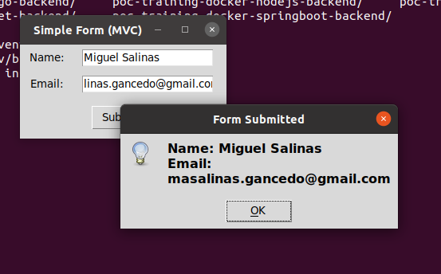

# Description
PoC for TCL/TK in Python using tkinter

# Steps to execute these samples
- Create a virtual environment in python to program and execute tkinter apps
 ```
$ git clone https://github.com/masalinas/poc-tcl-tk-python.git
$ cd poc-tcl-tk-python
$ python3 -m venv .venv
$ source .venv/bin/activate
$ pip install -r requitements.txt
```

- Execute the samples:

A sample form with a classical distribution
```
$ python form.py
```

The same sample form using the MVC pattern
```
$ python form_mvc.py
```



- If you add new dependencies to your project export these dependencies:

```
$ pip freeze > requirements.txt
```